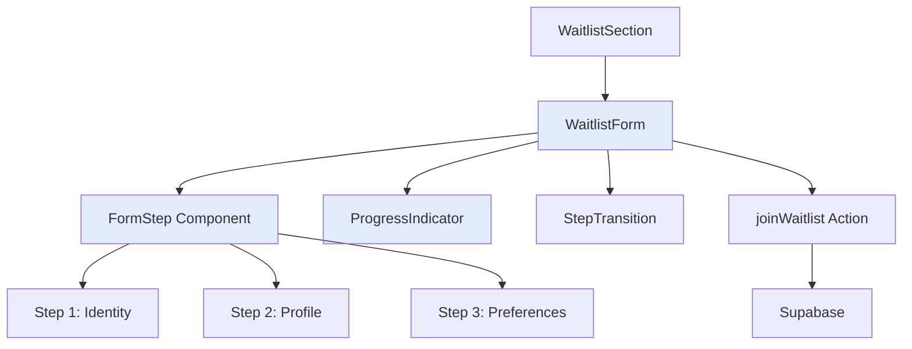
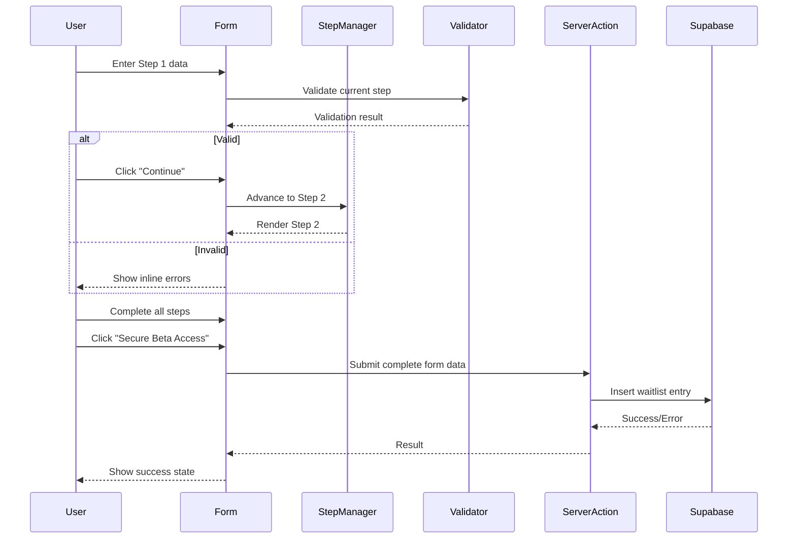

# Design Document: Waitlist Form Redesign

## Overview

This design transforms the existing waitlist form into a modern, elegant multi-step experience that reduces cognitive load and improves conversion rates. The redesign maintains all existing functionality while introducing progressive disclosure through a stepped form flow, enhanced visual aesthetics matching the brand's glass morphism identity, and smooth micro-interactions that guide users through the signup process.

## Architecture



## Main Algorithm/Workflow



## Core Interfaces/Types

```typescript
// Form step configuration
interface FormStep {
  id: number;
  title: string;
  description: string;
  fields: FormField[];
}

interface FormField {
  name: string;
  type: 'text' | 'email' | 'select';
  label: string;
  placeholder?: string;
  required: boolean;
  options?: SelectOption[];
}

interface SelectOption {
  value: string;
  label: string;
}

// Form state management
interface FormState {
  currentStep: number;
  totalSteps: number;
  formData: Record<string, string>;
  errors: Record<string, string>;
  touched: Record<string, boolean>;
}

// Component props
interface WaitlistFormProps {
  source: string;
  variant?: 'simple' | 'full';
  className?: string;
}

interface StepIndicatorProps {
  currentStep: number;
  totalSteps: number;
  onStepClick?: (step: number) => void;
}

interface FormStepProps {
  step: FormStep;
  formData: Record<string, string>;
  errors: Record<string, string>;
  onChange: (name: string, value: string) => void;
  onBlur: (name: string) => void;
  disabled: boolean;
}
```

## Key Functions with Formal Specifications

### Function 1: useMultiStepForm()

```typescript
function useMultiStepForm(
  steps: FormStep[],
  initialData?: Record<string, string>
): MultiStepFormReturn;
```

**Preconditions:**

- `steps` is a non-empty array of FormStep objects
- Each step has at least one field
- `initialData` (if provided) contains valid field names

**Postconditions:**

- Returns form state manager with current step tracking
- Provides navigation functions (next, previous, goToStep)
- Maintains form data across step transitions
- Validates current step before allowing progression

**Loop Invariants:** N/A

### Function 2: validateStep()

```typescript
function validateStep(
  step: FormStep,
  formData: Record<string, string>
): ValidationResult;
```

**Preconditions:**

- `step` is a valid FormStep object
- `formData` contains entries for all fields in the step

**Postconditions:**

- Returns object with `isValid` boolean and `errors` map
- `isValid` is true if and only if all required fields are filled and valid
- `errors` contains descriptive messages for each invalid field
- No mutations to input parameters

**Loop Invariants:**

- For validation loops: All previously validated fields remain in consistent state

### Function 3: handleStepTransition()

```typescript
function handleStepTransition(
  direction: 'next' | 'previous',
  currentStep: number
): void;
```

**Preconditions:**

- `direction` is either "next" or "previous"
- `currentStep` is within valid range [1, totalSteps]
- If direction is "next", current step validation has passed

**Postconditions:**

- Updates current step index appropriately
- Triggers animation sequence for step transition
- Preserves form data during transition
- Updates progress indicator state

**Loop Invariants:** N/A

## Algorithmic Pseudocode

### Main Form Workflow Algorithm

```pascal
ALGORITHM multiStepFormWorkflow(source, variant)
INPUT: source (string), variant ("simple" | "full")
OUTPUT: Rendered form component with step management

BEGIN
  // Initialize form state
  steps ← defineFormSteps(variant)
  currentStep ← 1
  formData ← {}
  errors ← {}
  status ← "idle"

  ASSERT steps.length > 0
  ASSERT currentStep >= 1 AND currentStep <= steps.length

  // Main form interaction loop
  WHILE status != "success" DO
    ASSERT formDataIsConsistent(formData, steps)

    // Render current step
    currentStepConfig ← steps[currentStep - 1]
    RENDER FormStep(currentStepConfig, formData, errors)
    RENDER ProgressIndicator(currentStep, steps.length)

    // Handle user input
    ON fieldChange(fieldName, value) DO
      formData[fieldName] ← value
      errors[fieldName] ← null
    END ON

    // Handle navigation
    ON nextButtonClick DO
      validationResult ← validateStep(currentStepConfig, formData)

      IF validationResult.isValid THEN
        IF currentStep < steps.length THEN
          ANIMATE stepTransition("forward")
          currentStep ← currentStep + 1
        ELSE
          // Final step - submit form
          result ← submitForm(formData, source)
          IF result.success THEN
            status ← "success"
            RENDER SuccessState(result.message)
          ELSE
            errors["form"] ← result.message
            status ← "error"
          END IF
        END IF
      ELSE
        errors ← validationResult.errors
        RENDER InlineErrors(errors)
      END IF
    END ON

    ON previousButtonClick DO
      IF currentStep > 1 THEN
        ANIMATE stepTransition("backward")
        currentStep ← currentStep - 1
      END IF
    END ON
  END WHILE

  ASSERT status = "success" IMPLIES formData is submitted
END
```

**Preconditions:**

- source is a non-empty string
- variant is either "simple" or "full"
- Form steps are properly configured

**Postconditions:**

- Form successfully submitted OR user still interacting
- All form data preserved during navigation
- Validation errors displayed appropriately

**Loop Invariants:**

- currentStep always within valid range [1, steps.length]
- formData contains entries for all touched fields
- Form state remains consistent throughout interaction

### Step Validation Algorithm

```pascal
ALGORITHM validateStep(step, formData)
INPUT: step (FormStep), formData (Record<string, string>)
OUTPUT: validationResult (ValidationResult)

BEGIN
  errors ← {}
  isValid ← true

  // Validate each field in the step
  FOR each field IN step.fields DO
    ASSERT field.name is defined

    value ← formData[field.name]

    // Check required fields
    IF field.required AND (value = null OR value = "") THEN
      errors[field.name] ← field.label + " is required"
      isValid ← false
      CONTINUE
    END IF

    // Type-specific validation
    IF field.type = "email" AND value != null THEN
      IF NOT isValidEmail(value) THEN
        errors[field.name] ← "Please enter a valid email address"
        isValid ← false
      END IF
    END IF

    IF field.type = "text" AND value != null THEN
      IF value.length < 2 THEN
        errors[field.name] ← field.label + " is too short"
        isValid ← false
      END IF
    END IF
  END FOR

  RETURN {isValid: isValid, errors: errors}
END
```

**Preconditions:**

- step is a valid FormStep with defined fields
- formData is a valid object (may be empty)

**Postconditions:**

- Returns validation result with isValid flag and errors map
- isValid is true if and only if all required fields pass validation
- errors map contains descriptive messages for each invalid field

**Loop Invariants:**

- All previously validated fields remain in errors map if invalid
- isValid flag accurately reflects validation state at each iteration

### Animation Transition Algorithm

```pascal
ALGORITHM animateStepTransition(direction)
INPUT: direction ("forward" | "backward")
OUTPUT: Completed animation sequence

BEGIN
  // Define animation parameters
  IF direction = "forward" THEN
    exitX ← -100
    enterX ← 100
  ELSE
    exitX ← 100
    enterX ← -100
  END IF

  duration ← 0.4
  easing ← cubicBezier(0.22, 1, 0.36, 1)

  SEQUENCE
    // Phase 1: Exit current step
    ANIMATE currentStepElement DO
      opacity: 1 → 0
      translateX: 0 → exitX + "%"
      duration: duration
      easing: easing
    END ANIMATE

    // Phase 2: Update DOM
    WAIT duration
    UPDATE currentStepContent

    // Phase 3: Enter new step
    ANIMATE newStepElement DO
      opacity: 0 → 1
      translateX: enterX + "%" → 0
      duration: duration
      easing: easing
    END ANIMATE
  END SEQUENCE

  ASSERT animation completed smoothly
END
```

**Preconditions:**

- direction is either "forward" or "backward"
- Current step element exists in DOM
- New step content is ready to render

**Postconditions:**

- Smooth transition animation completed
- New step is visible and interactive
- Previous step is removed from view
- No visual glitches or layout shifts

**Loop Invariants:** N/A

## Example Usage

```typescript
// Example 1: Basic multi-step form usage
<WaitlistForm source="home" variant="full" />

// Example 2: Simple variant (single step, no stepping)
<WaitlistForm source="hero" variant="simple" />

// Example 3: Custom hook usage
const {
  currentStep,
  totalSteps,
  formData,
  errors,
  next,
  previous,
  goToStep,
  updateField,
  validateCurrentStep,
  submitForm
} = useMultiStepForm(steps);

// Navigate forward
const handleNext = async () => {
  const isValid = await validateCurrentStep();
  if (isValid) {
    next();
  }
};

// Navigate backward
const handlePrevious = () => {
  previous();
};

// Update field value
const handleFieldChange = (name: string, value: string) => {
  updateField(name, value);
};

// Submit final form
const handleSubmit = async () => {
  const result = await submitForm();
  if (result.success) {
    // Show success state
  }
};
```

## Correctness Properties

_A property is a characteristic or behavior that should hold true across all valid executions of a system—essentially, a formal statement about what the system should do. Properties serve as the bridge between human-readable specifications and machine-verifiable correctness guarantees._

### Property 1: Step Progression Invariant

For any step in the range [1, totalSteps-1], the form can only advance to the next step if the current step's validation returns isValid as true.

**Validates: Requirements 1.2, 1.3, 3.1**

### Property 2: Data Persistence

For any form field and any sequence of step transitions, the value stored in formData for that field remains unchanged unless explicitly modified by user input.

**Validates: Requirements 1.5, 4.1, 4.2, 4.3, 4.4**

### Property 3: Step Index Bounds

For any sequence of navigation operations (next, previous, goToStep), the current step index always remains within the valid range of 1 to totalSteps inclusive.

**Validates: Requirements 1.6**

### Property 4: Validation Completeness

For any form submission attempt, the form can only be submitted if all required fields across all steps contain non-empty, valid values.

**Validates: Requirements 2.4, 6.1**

### Property 5: Validation Purity

For any form data and validation operation, the validator returns a validation result without mutating the input form data.

**Validates: Requirements 2.6**

### Property 6: Animation Consistency

For any step transition animation, while the animation is in progress (isAnimating === true), all user input controls are disabled (userInputDisabled === true).

**Validates: Requirements 3.5, 7.4**

### Property 7: Error State Clarity

For any form field, if a validation error is displayed for that field, then the user must have interacted with (touched) that field.

**Validates: Requirements 8.5**

### Property 8: Error Clearing on Change

For any form field with a displayed error, when the user modifies the field value, the error message for that field is immediately cleared.

**Validates: Requirements 8.2**

### Property 9: Submission Data Preservation

For any form submission that fails (due to server error or network error), all form data remains intact and unchanged, allowing the user to retry without re-entering information.

**Validates: Requirements 6.6, 15.4**

### Property 10: Email Sanitization

For any email address submitted through the form, the submitted value is transformed to lowercase with leading and trailing whitespace removed.

**Validates: Requirements 12.1, 12.2, 12.3**

### Property 11: Progress Indicator Synchronization

For any change in the current step index, the Progress Indicator updates to reflect the new current step, displaying the correct step number and total steps.

**Validates: Requirements 5.1, 5.2**

### Property 12: Field Type Rendering

For any form field configuration, the rendered input element type matches the field's specified type (text renders text input, email renders email input, select renders dropdown).

**Validates: Requirements 10.1, 10.2, 10.3**

### Property 13: Required Field Validation

For any required field that is empty or contains only whitespace, validation returns an error indicating the field is required.

**Validates: Requirements 2.1**

### Property 14: Animation Direction Consistency

For any forward navigation, the animation moves content from right to left; for any backward navigation, the animation moves content from left to right.

**Validates: Requirements 7.1, 7.2**

### Property 15: Keyboard Navigation

For any form state, pressing Tab moves focus to the next interactive element in logical order, and pressing Enter triggers the appropriate action (next for non-final steps, submit for final step).

**Validates: Requirements 13.1, 13.2, 13.3**

## Step Configuration

### Full Variant Steps

**Step 1: Identity** (Required fields)

- full_name (text)
- email (email)

**Step 2: Profile** (Required + Optional)

- role (select) - Required
- company (text) - Optional

**Step 3: Preferences** (Optional fields)

- revenue_range (select) - Optional
- aesthetic (select) - Optional

### Simple Variant

- Single step with email only
- Hidden fields: full_name="Early Access User", role="Other"

## Visual Design Specifications

### Glass Morphism Styling

```css
.form-card {
  backdrop-filter: blur(30px);
  background: hsla(var(--card), 0.8);
  border: 1px solid rgba(255, 255, 255, 0.05);
  border-radius: 2rem;
}

.form-card::after {
  content: '';
  position: absolute;
  inset: 0;
  background: url('/noise.svg');
  opacity: 0.03;
  pointer-events: none;
}
```

### Progress Indicator

- Horizontal step dots with connecting lines
- Active step: aq-blue (#2563eb) with glow effect
- Completed steps: aq-blue solid
- Upcoming steps: muted with opacity
- Smooth transitions between states

### Input Fields

- Height: 3rem (h-12)
- Border radius: 0.75rem (rounded-xl)
- Background: background/40 with backdrop blur
- Border: white/10 default, aq-blue/50 on focus
- Transition: all properties 200ms ease
- Label: uppercase, tracking-widest, text-xs

### Buttons

- Primary CTA: brand variant with aq-blue gradient
- Height: 3.5rem (h-14)
- Border radius: 0.75rem (rounded-xl)
- Shadow: shadow-lg shadow-aq-blue/20
- Hover: increased shadow intensity

### Animations

- Step transitions: 400ms cubic-bezier(0.22, 1, 0.36, 1)
- Field focus: 200ms ease
- Button hover: 200ms ease
- Success state: scale + fade animation

## Error Handling

### Validation Errors

- Inline display below each field
- Red text (destructive color)
- Appear on blur or submit attempt
- Clear on field change

### Server Errors

- Display at form level (above submit button)
- Duplicate email: "This email is already on the waitlist!"
- Generic error: "Something went wrong. Please try again."
- Persist until user modifies form

### Network Errors

- Retry mechanism with exponential backoff
- User-friendly error messages
- Maintain form state during retry

## Testing Strategy

### Unit Testing Approach

Test individual functions and components in isolation:

- `useMultiStepForm` hook: Test state management, navigation, validation
- `validateStep` function: Test all validation rules and edge cases
- `FormStep` component: Test rendering, user input, error display
- `ProgressIndicator` component: Test visual state updates

Key test cases:

- Step navigation (forward, backward, direct jump)
- Field validation (required, email format, length constraints)
- Form data persistence across steps
- Error state management
- Success state rendering

### Property-Based Testing Approach

**Property Test Library**: fast-check (for TypeScript/React)

Generate random form inputs and verify invariants:

- Step progression only occurs with valid data
- Form data never lost during navigation
- Validation errors always correspond to invalid fields
- Animation states prevent premature interaction

### Integration Testing Approach

Test complete user flows:

- Happy path: Fill all steps → Submit → Success
- Validation path: Invalid input → Error → Correction → Success
- Navigation path: Forward → Backward → Forward → Submit
- Server error path: Submit → Error → Retry → Success

## Performance Considerations

- Debounce validation on field change (300ms)
- Memoize step configurations to prevent re-renders
- Use React.memo for FormStep components
- Lazy load success animation assets
- Optimize animation performance with transform and opacity only
- Preload next step content during current step interaction

## Security Considerations

- Client-side validation for UX, server-side for security
- Email sanitization (lowercase, trim)
- SQL injection prevention via Supabase parameterized queries
- Rate limiting on server action (handled by Supabase)
- CSRF protection via Next.js server actions
- No sensitive data in client state
- Secure transmission over HTTPS

## Dependencies

### Existing Dependencies

- React 18+ (hooks, transitions)
- Framer Motion (animations)
- Zod (validation schema)
- Supabase (database)
- Next.js (server actions)

### New Dependencies

None required - all functionality achievable with existing stack

### UI Components

- Button (existing)
- Input (existing)
- Custom ProgressIndicator (new)
- Custom FormStep (new)
- Custom StepTransition wrapper (new)
